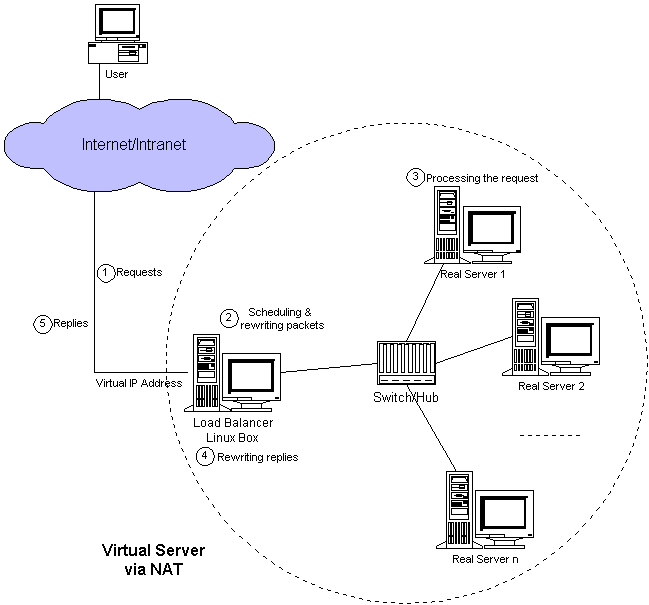

- [負載均衡器（Load Balancer, LB）簡介](#%E8%B2%A0%E8%BC%89%E5%9D%87%E8%A1%A1%E5%99%A8load-balancer-lb%E7%B0%A1%E4%BB%8B)
  - [正向 vs. 反向代理伺服器](#%E6%AD%A3%E5%90%91-vs-%E5%8F%8D%E5%90%91%E4%BB%A3%E7%90%86%E4%BC%BA%E6%9C%8D%E5%99%A8)
  - [反向代理器補充：keepalived，確保使用者可用性（可連線上）](#%E5%8F%8D%E5%90%91%E4%BB%A3%E7%90%86%E5%99%A8%E8%A3%9C%E5%85%85keepalived%E7%A2%BA%E4%BF%9D%E4%BD%BF%E7%94%A8%E8%80%85%E5%8F%AF%E7%94%A8%E6%80%A7%E5%8F%AF%E9%80%A3%E7%B7%9A%E4%B8%8A)
  - [Apache vs nginx Server](#apache-vs-nginx-server)
- [LVS](#lvs)
  - [環境設置](#%E7%92%B0%E5%A2%83%E8%A8%AD%E7%BD%AE)
  - [工作模式](#%E5%B7%A5%E4%BD%9C%E6%A8%A1%E5%BC%8F)
    - [1. NAT 模式（Packet Rewriting）](#1-nat-%E6%A8%A1%E5%BC%8Fpacket-rewriting)
    - [2. Tunnel](#2-tunnel)
    - [3. Direct Routing, DR](#3-direct-routing-dr)
    - [補充說明：ipvsadm](#%E8%A3%9C%E5%85%85%E8%AA%AA%E6%98%8Eipvsadm)
- [壓力測試（Stress Testing）](#%E5%A3%93%E5%8A%9B%E6%B8%AC%E8%A9%A6stress-testing)
- [負載均衡器：Keepalived + LVS](#%E8%B2%A0%E8%BC%89%E5%9D%87%E8%A1%A1%E5%99%A8keepalived--lvs)
  - [LVS](#lvs-1)
  - [環境配置](#%E7%92%B0%E5%A2%83%E9%85%8D%E7%BD%AE)
  - [安裝步驟(1/2)](#%E5%AE%89%E8%A3%9D%E6%AD%A5%E9%A9%9F12)
  - [安裝步驟(2/2)](#%E5%AE%89%E8%A3%9D%E6%AD%A5%E9%A9%9F22)
- [參考資料](#%E5%8F%83%E8%80%83%E8%B3%87%E6%96%99)
  - [LVS 工作模式](#lvs-%E5%B7%A5%E4%BD%9C%E6%A8%A1%E5%BC%8F)
  - [Keepalived, LVS](#keepalived-lvs)

---

# 負載均衡器（Load Balancer, LB）簡介
* 因為這學期課名為「自動化運(作)維(護)」，會討論如何讓伺服器執行更順暢，因此會談及「Load Balance」
* 相關主題：
    * LVS
    * haproxy
    * 註：有時候 nginx 也能當作反向代理伺服器
* LB 入口前端會有 Virtual IP, VIP，能避免直接暴露主機位址到 Internet 上

## 正向 vs. 反向代理伺服器
-|正向（Proxy）|反向（Reverse Proxy）
-|-|-
設置位置|Client|Server
功能|類似於快取伺服器，節省對外頻寬|負載均衡（Load Balance）
相關套件|Squid|LVS, haproxy
介紹圖||

> * 註：nginx 並非專門的 Load Balancer，因為採用 Round Robin 機制，會輪流詢問各個主機（沒有優先權概念），導致效能較好的主機不能長時間佔用。
> * 因此一般還是建議採用 LVS, haproxy

## 反向代理器補充：keepalived，確保使用者可用性（可連線上）
* 會不斷送封包給主機，確保主機還在執行中，避免使用者連線不上的窘況（連到不正常執行的主機，但其他主機還正常執行）
* Ref：[使用 Haproxy + Keepalived 构建基于 Docker 的高可用负载均衡服务（一） - Coding 博客](https://blog.coding.net/blog/Haproxy&keepalived)

## Apache vs nginx Server
* 一臺 Apache Server 最高同時只有約一萬臺連線數
* 但 nginx 因為它採取輪詢的機制（為事件驅動的方式），因此最高能支援到約三萬臺連線數
* 儘管 nginx 效能較好，但針對現今的環境可能還是不夠用

# LVS
* 負載均衡目的：把客戶的請求適當地分配給不同的伺服器
* 種類：
  > LVS 是基於 Layer 4 的負載均衡器；nginx、haproxy 則是基於 Layer 7 的負載均衡器，前者能把使用者的請求看得更清楚，更靈活且更有效率。
  * LVS(Linux Virtual Server) // 今天要介紹的
  * Ngnix
  * FS
* 專有名詞
  * CIP : Client IP
  * VIP <-> RIP : Virtual IP <-> Real IP
  * LB : Load Balancer
  * RS : Real Server
* 工作模式
  * NAT
  * Tunnel
  * DR
* 排程（Scheduling）
  * RR（Round Robin）
  * WRR（Weighted Round Robin）
  * Least Connection First

## 環境設置
* 三臺網路介面卡皆為 NAT + Host only, RAM: 512MB ~ 1G
* 三臺機器 LB, RS1, RS2 分別對應到 `192.168.56.103`, `.102`, `.104`
* RS1, RS2 都要安裝 Apache 並開啟：
```sh
# 安裝 Apache（略）
systemctl start httpd
cd /var/www/html
echo web1 > index.html # 若是 RS2 則將 web1 更改為 web2
```

## 工作模式
-|NAT|Tunnel|Direct Routing
-|-|-|-
功能|將封包改寫(*1)|把原本封包在包在另一個 IP 標頭（Layer 3）|修改 MAC 層位置（Layer 2）
示意圖|||

* *1：將封包改寫，原本 [CIP | VIP] 會轉換成 [CIP | RIP1] 或 [CIP | RIP2]

### 1. NAT 模式（Packet Rewriting）
* 功能：將封包改寫，原本 [CIP | VIP] 會轉換成 [CIP | RIP1] 或 [CIP | RIP2]
* 限制：LB 與 RS 需在同一個區域網路中
* 優點
  * 設置較簡單
* 缺點
  * 效率較差，因為 Load Balancer 還需要做 Port Forwarding，負擔較重

### 2. Tunnel
* 功能：把原本封包在包在另一個 IP 標頭（Layer 3）
* 特性
  * LB 不支援 Port Mapping
  * RS 的 OS 需支援 Tunnel
* 優點
  * cluster nodes 可跨越 Internet（不限於在同個區域網路下）
  * 效率較佳
  * 回程時 LB 不用再做 Port Forwarding
* 缺點
  * 維護成本較高，因為需要建立 Tunnel


### 3. Direct Routing, DR
* 功能：修改 MAC 層位置（Layer 2）
* 注意：需把 ARP request 功能關閉
  * 否則 LB, RS1, RS2... 的 loopback 皆為 VIP，如果對 VIP 作 ARP Request，LB, RS1, RS2 都會作回應
* 優點
  * 不限於在同個區域網路下
  * 效率最佳

### 補充說明：ipvsadm
* 功能：______
* machine 1 : `yum install ipvsadm -y`
* `-A`, `--add-service` : **Add a virtual service.**  A  service  address  is uniquely defined by a triplet: IP address, port number, and protocol. Alternatively, a  virtual service may be defined by a firewall-mark.
* `-a`, `--add-server` : **Add a real server** to a virtual service.
* `-t`, `--tcp-service service-address` : **Use TCP service.** The service-address is of  the
form  host[:port].
* `-s`, `--scheduler` : scheduling-method

---

* `-m`,  `--masquerading` : Use masquerading (network access translation, or **NAT**).
* `-g`, `--gatewaying` : Use gatewaying (**direct  rout‐ing, DR**). This is the default.

---

* `-L`, `-l`, `--list` : **List the virtual server table if no argument is specified.**  If  a  service-address is selected, list this service only. If  the  -c  option  is selected,  then  display  the connection table. The exact output is affected by the other argu‐ ments given. 

# 壓力測試（Stress Testing）
* ApacheBench
* Siege

# 負載均衡器：Keepalived + LVS
* 
* keepalived : 容錯（Fault Tolerance）
* LVS : 傳輸效能提升

## LVS
* 全名：Linux Virtual Server
* 虛擬的服務器集群系統
* 屬於第 4 層(傳輸層)負載平衡器

## 環境配置
* Client
  * CentOS
  * Host-only + 內部網路
* Router1, 2
  * 需要用到 LVS，但由於 CentOS 的 LVS 有點問題，因此改用 Ubuntu
  * NAT + 內部網路 + Host-only
* web1, 2
  * CentOS
  * 內部網路(intnet)

## 安裝步驟(1/2)
> 由於時間的限制，課堂中可以先在 Router1, 2 做 Keepalived，測試如果 `ifdown` Router1 的話，會不會自動轉到 Router2
* 參照自參考資料 1
1. 在 Router1, 2 上安裝 ipvsadm 與 keepalived
```
sudo apt-get install ipvsadm keepalived
```
2. 配置 keepalived
* keepalived 能直接透過修改配置文件來配置，不需再透過 `ipvsadm` 指令
```
vim /etc/keepalived/keepalived.conf # 修改配置檔案
```

## 安裝步驟(2/2)
> 完整：KeepAlived + LVS，共有五台伺服器

# 參考資料
## LVS 工作模式
* 參照：[Maxkit: 三種 LVS 的模式：LVS-NAT、LVS-TUN、LVS-DR](http://blog.maxkit.com.tw/2016/05/lvs-lvs-natlvs-tunlvs-dr.html)
* 參照：[Lvs之NAT、DR、TUN三种模式的应用配置案例-大風-51CTO博客](https://blog.51cto.com/lansgg/1229421)


## Keepalived, LVS
1. [The keepalived solution for LVS](http://www.linuxvirtualserver.org/docs/ha/keepalived.html)
2. [LVS Keepalived雙機高可用負載均衡搭建-Linux運維日誌](https://www.centos.bz/2017/07/lvs-keepalived-ha-loadbalace/)
3. [lvs詳細介紹及lvs和keepalived的使用-Linux運維日誌](https://www.centos.bz/2017/09/lvs-intro-and-lvs-keepalived/)