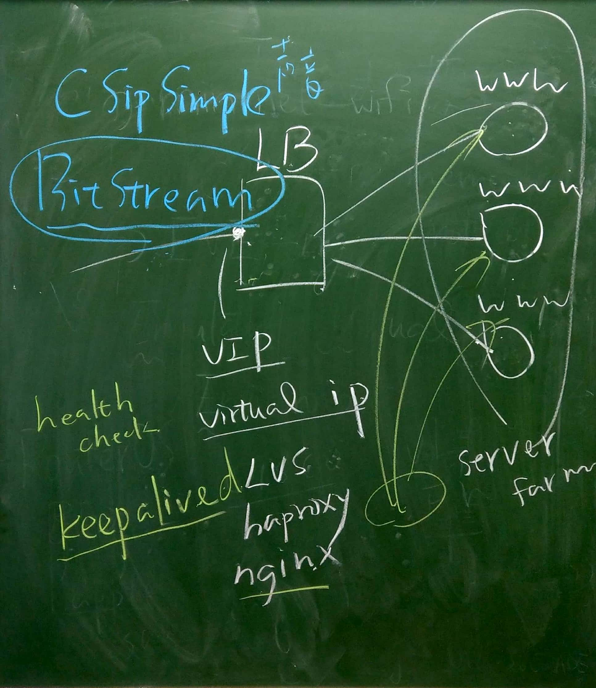

- [概論](#%E6%A6%82%E8%AB%96)
  - [期中、期末評量方式](#%E6%9C%9F%E4%B8%AD%E6%9C%9F%E6%9C%AB%E8%A9%95%E9%87%8F%E6%96%B9%E5%BC%8F)
- [Load Balance, LB](#load-balance-lb)
  - [正向 vs. 反向代理伺服器](#%E6%AD%A3%E5%90%91-vs-%E5%8F%8D%E5%90%91%E4%BB%A3%E7%90%86%E4%BC%BA%E6%9C%8D%E5%99%A8)
    - [正向代理伺服器（Proxy）](#%E6%AD%A3%E5%90%91%E4%BB%A3%E7%90%86%E4%BC%BA%E6%9C%8D%E5%99%A8proxy)
    - [反向代理器補充：keepalived，確保使用者可用性（可連線上）](#%E5%8F%8D%E5%90%91%E4%BB%A3%E7%90%86%E5%99%A8%E8%A3%9C%E5%85%85keepalived%E7%A2%BA%E4%BF%9D%E4%BD%BF%E7%94%A8%E8%80%85%E5%8F%AF%E7%94%A8%E6%80%A7%E5%8F%AF%E9%80%A3%E7%B7%9A%E4%B8%8A)
    - [Apache vs nginx Server](#apache-vs-nginx-server)
- [監控軟體](#%E7%9B%A3%E6%8E%A7%E8%BB%9F%E9%AB%94)
- [自動化管理](#%E8%87%AA%E5%8B%95%E5%8C%96%E7%AE%A1%E7%90%86)
- [腳本](#%E8%85%B3%E6%9C%AC)
- [本堂課會講比較有趣的內容：VoIP（網路電話）、直播系統](#%E6%9C%AC%E5%A0%82%E8%AA%B2%E6%9C%83%E8%AC%9B%E6%AF%94%E8%BC%83%E6%9C%89%E8%B6%A3%E7%9A%84%E5%85%A7%E5%AE%B9voip%E7%B6%B2%E8%B7%AF%E9%9B%BB%E8%A9%B1%E7%9B%B4%E6%92%AD%E7%B3%BB%E7%B5%B1)
  - [VoIP](#voip)
- [直播系統](#%E7%9B%B4%E6%92%AD%E7%B3%BB%E7%B5%B1)
- [雜記](#%E9%9B%9C%E8%A8%98)

---

# 概論
* 本學期課本還要講：DNS, Docker
* 除了課本的內容，Docker 還會補充 Docker - compose, SWAM

## 期中、期末評量方式
* 整理成筆記，再分享到網路上（如 GitHub）
* 如果沒有講到的部分，可以自己去練習（如課堂中上 `haproxy`，自己可以去實作 `LVS`），期末時再上臺報告

# Load Balance, LB
* 因為這學期課名為「自動化運(作)維(護)」，會討論如何讓伺服器執行更順暢，因此會談及「Load Balance」
* 相關主題：
    * LVS
    * haproxy
    * 註：有時候 nginx 也能當作反向代理伺服器
* LB 入口前端會有 Virtual IP, VIP，能避免直接暴露主機位址到 Internet 上

## 正向 vs. 反向代理伺服器
### 正向代理伺服器（Proxy）
* 類似於快取伺服器，能節省對外頻寬，套件如 Squid
* 設置於 Client 端
* 
* 反向代理伺服器：能達到 Load Balance 的目的，套件如 LVS, haproxy
    * 設置於 Server 端
    * 
    * 註：nginx 並非專門的 Load Balancer，因為採用 Round Robin 機制，會輪流詢問各個主機（沒有優先權概念），導致效能較好的主機不能長時間佔用。因此一般還是建議採用 LVS, haproxy

### 反向代理器補充：keepalived，確保使用者可用性（可連線上）
* 會不斷送封包給主機，確保主機還在執行中，避免使用者連線不上的窘況（連到不正常執行的主機，但其他主機還正常執行）
* Ref：[使用 Haproxy + Keepalived 构建基于 Docker 的高可用负载均衡服务（一） - Coding 博客](https://blog.coding.net/blog/Haproxy&keepalived)

### Apache vs nginx Server
* 一臺 Apache Server 最高同時只有約一萬臺連線數
* 但 nginx 卻能支援到，因為它採取輪詢的機制（為事件驅動的方式），因此最高能支援到約三萬臺連線數
* 儘管 nginx 效能較好，但針對現今的環境可能還是不夠用

# 監控軟體
* zabbix : 功能較強大
    * 如服務壞掉，傳統上只能透過 E-mail 通知。但透過其中的二次開發功能，能寫出透過第三方通訊軟體（如 Line）發送通知的功能。
* nagios : 較簡單，本學期所要學的
    * 有分作直接監控、間接監控
        * 直接監控：監視器與被控端直接連接（能透過 ping, curl 等指令確認）
        * 間接監控：有些系統資源沒辦法直接量測，因此派一個 agent 在被控端偵測，再回傳給監視端

# 自動化管理
* 當管理大量的裝置時，不可能一臺一臺設置，因此需要有大量管理的工具，方便部署與更新。
* 常見工具有 saltstack, ansible, puppet
    * 本學期應該會教 saltstack（因為老師較熟悉 XD）

# 腳本
* 應用如偵測 ARP 攻擊
* 易於管理與維護

# 本堂課會講比較有趣的內容：VoIP（網路電話）、直播系統
## VoIP
* Ref : [Build your own VoIP System – Part 2: An open Skype Replacement](https://www.sipwise.org/news/technical/byov-skype-replacement/)

# 直播系統
* Ref : [在Centos7上搭建Nginx+rtmp服务器 - 简书](https://www.jianshu.com/p/4ed63b041bd9)
* RTMP : 直播串流用的通訊協定
* TODO : 補上操作過程

# 雜記
* 要先瞭解此工具為什麼存在？再去操作
* 部分課程會在 imooc 與 51cto 等 MOOC 網站
    * 老師強調要不斷重複
* Linux 三劍客，重要的篩選工具：`sed`(string editor), `awk`, `grep`