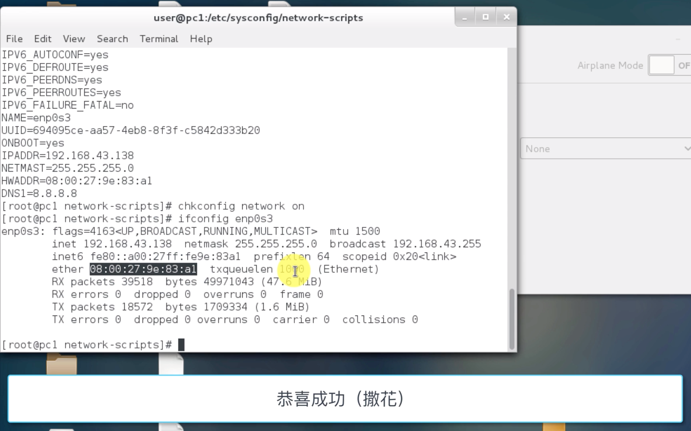

<!-- ### 原本的網路狀態
```
[root@pc1 network-scripts]# ifconfig enp0s3
enp0s3: flags=4163<UP,BROADCAST,RUNNING,MULTICAST>  mtu 1500
        inet 192.168.43.138  netmask 255.255.255.0  broadcast 192.168.43.255
        inet6 fe80::a00:27ff:fe9e:83a1  prefixlen 64  scopeid 0x20<link>
        ether 08:00:27:9e:83:a1  txqueuelen 1000  (Ethernet)
        RX packets 105188  bytes 158710188 (151.3 MiB)
        RX errors 0  dropped 0  overruns 0  frame 0
        TX packets 37764  bytes 2580251 (2.4 MiB)
        TX errors 0  dropped 0 overruns 0  carrier 0  collisions 0

enp0s8: flags=4163<UP,BROADCAST,RUNNING,MULTICAST>  mtu 1500
        inet 192.168.56.101  netmask 255.255.255.0  broadcast 192.168.56.255
        inet6 fe80::a00:27ff:fe65:10fa  prefixlen 64  scopeid 0x20<link>
        ether 08:00:27:65:10:fa  txqueuelen 1000  (Ethernet)
        RX packets 27  bytes 4255 (4.1 KiB)
        RX errors 0  dropped 0  overruns 0  frame 0
        TX packets 27  bytes 4511 (4.4 KiB)
        TX errors 0  dropped 0 overruns 0  carrier 0  collisions 0
``` -->
# 操作影片
> 點擊進入 Youtube 網站觀看

[](http://www.youtube.com/watch?v=Iqd6LMNxFjg)

# 詳細步驟
> 注意大小寫有別：`NetworkManager` 首字為大寫；`network` 首字為小寫。

> 以下指令在超級使用者(root)權限下操作

1. 使用 `systemctl` 設定開機時不啟用 NetworkManager 服務
```
systemctl disable NetworkManager
```

2. 停止 NetworkManager 服務
```
systemctl stop NetworkManager
```

3. 確認 NetworkManager 服務是否關閉（看到 `Active: inactive (dead)` 代表服務已關閉）
```
systemctl status NetworkManager
```

4. 切換到系統網路組態目錄 `/etc/sysconfig/network-scripts`
```
cd /etc/sysconfig/network-scripts
```

5. 因為想透過 `ifcfg-enp0s3` 檔案作網路設定，所以移除 `ifcfg-Auto Ethernet` 檔案來避免衝突
```
rm -rf ifcfg-Auto Ethernet
```

6. 啟動 network 服務
```
systemctl start network
```

7. 確認 network 服務是否已開啟（看到 ` Active: active (exited)` 代表服務已開啟）
```
systemctl status network
```

8. 透過 `ifconfig` 記錄下當前的 IP, netmask, MAC Address
```
ifconfig enp0s3
```
* 以筆者環境為例：
    * IP(*IPADDR*) : inet **192.168.43.138**
    * netmask(*NETMASK*) : netmask **255.255.255.0**
    * MAC Address(*HWADDR*) : ether **08:00:27:9e:83:a1**

9. 透過 vim (或 gedit 等編輯器) 來編輯 `ifcfg-enp0s3` 檔案
```
vim ifcfg-enp0s3
```

10. 將 `ifcfg-enp0s3` 檔案新增/編輯以下幾行：
> 修改好的檔案可參考下方的資料
* 欲修改的行
    * `BOOTPROTO=static`（從原先 `dhcp` 動態設定 IP 改為手動的 `static`）
    * `ONBOOT=yes`（設定為開機自動按照此檔案設定網路）
* 欲新增的行（要填入的值請參考步驟 8）
    * `IPADDR=要填入的值`
    * `NETMASK=要填入的值`
    * `HWADDR=要填入的值`
    * `DNS1=8.8.8.8`（選擇項，手動指定 DNS server，這邊可設定為 Google Public DNS 的 `8.8.8.8`）

11. 透過瀏覽器開啟網頁，或透過 `ping` 指令來測試
* `-I enp0s3`：指定 `enp0s3` 介面
* `-c 3`：執行三次
```
ping -I enp0s3 8.8.8.8 -c 3
```

12. 透過 `ifup` 指令來啟用網路介面
```
ifup enp0s3
```

13. 使用 `chkconfig` 設定開機時啟用 network 服務
```
chkconfig network on
```

14. 成功
---

# 參考資料
### history
```
345  systemctl disableNetworkManager
346  systemctl disable NetworkManager
347  systemctl stop NetworkManager
348  cd /etc/sysconfig/network
349  cd /etc/sysconfig/network-scripts
350  systemctl status NetworkManager
351  ls
352  vi ifcfg-enp0s3
353  vi ifcfg-enp0s3-1
354  diff
355  cf
356  diff ifcfg-enp0s3 ifcfg-enp0s3-1
357  cat ifcfg-enp0s3-1
358  rm -rf ifcfg-enp0s3-1
359  ls
360  catt ifcfg-Auto-Ethernet
361  cat ifcfg-Auto-Ethernet
362  cat ifcfg-Auto_Ethernet 
363  rm -rf ifcfg-Auto_Ethernet 
364  ls
365  rm -rf ifcfg-lo
366  ifconfig
367  ifconfig enp0s3
368  systemctl status network
369  systemctl status NetworkManager
370  systemctl status network
371  systemctl start network
372  systemctl status network
373  ls
374  vi ifcfg-enp0s3
375  ifconfig enp0s3
376  ifup enp0s3
377  ifconfig enp0s3
378  vi enp0s3
379  ls
380  cat ifcfg-enp0s3
381  ping google.com.tw
382  cat ifcfg-enp0s3
383  ifconfig enp0s3
384  ping google.com -c 1
385  ping www.nqu.edu.tw -c 1
386  ping -l enp0s3 8.8.8.8
387  mac ping
388  man ping
389  ping -i enp0s3 8.8.8.8
390  man ping
391  ping -i enp0s3 8.8.8.8
392  ping -I enp0s3 8.8.8.8
393  history
```

### 原本的 enp0s3 網路狀態
```
[root@pc1 network-scripts]# ifconfig enp0s3
enp0s3: flags=4163<UP,BROADCAST,RUNNING,MULTICAST>  mtu 1500
        inet 192.168.43.138  netmask 255.255.255.0  broadcast 192.168.43.255
        inet6 fe80::a00:27ff:fe9e:83a1  prefixlen 64  scopeid 0x20<link>
        ether 08:00:27:9e:83:a1  txqueuelen 1000  (Ethernet)
        RX packets 179884  bytes 269689563 (257.1 MiB)
        RX errors 0  dropped 0  overruns 0  frame 0
        TX packets 61730  bytes 4291231 (4.0 MiB)
        TX errors 0  dropped 0 overruns 0  carrier 0  collisions 0
```

### 原本的 ifcfg-enp0s3 內容
```
TYPE=Ethernet
BOOTPROTO=dhcp
DEFROUTE=yes
IPV4_FAILURE_FATAL=no
IPV6INIT=yes
IPV6_AUTOCONF=yes
IPV6_DEFROUTE=yes
IPV6_FAILURE_FATAL=no
NAME=enp0s3
UUID=694095ce-aa57-4eb8-8f3f-c5842d333b20
ONBOOT=no
HWADDR=08:00:27:9E:83:A1
PEERDNS=yes
PEERROUTES=yes
IPV6_PEERDNS=yes
IPV6_PEERROUTES=yes
```

----- 修改 ifcfg-enp0s3 檔案分隔線 -----

### 修改後 ifcfg-enp0s3 內容
```
[root@pc1 network-scripts]# cat ifcfg-enp0s3
TYPE=Ethernet
BOOTPROTO=static
DEFROUTE=yes
IPV4_FAILURE_FATAL=no
IPV6INIT=yes
IPV6_AUTOCONF=yes
IPV6_DEFROUTE=yes
IPV6_FAILURE_FATAL=no
NAME=enp0s3
UUID=694095ce-aa57-4eb8-8f3f-c5842d333b20
ONBOOT=yes
IPADDR=192.168.43.138
GATEWAY=192.168.43.1
NETMASK=255.255.255.0
DNS1=8.8.8.8
HWADDR=08:00:27:9E:83:A1
PEERDNS=yes
PEERROUTES=yes
IPV6_PEERDNS=yes
IPV6_PEERROUTES=yes
```

### 修改後 enp0s3 網路狀態
* 基本上與修改前相同
```
[root@pc1 network-scripts]# ifconfig enp0s3
enp0s3: flags=4163<UP,BROADCAST,RUNNING,MULTICAST>  mtu 1500
        inet 192.168.43.138  netmask 255.255.255.0  broadcast 192.168.43.255
        inet6 fe80::a00:27ff:fe9e:83a1  prefixlen 64  scopeid 0x20<link>
        ether 08:00:27:9e:83:a1  txqueuelen 1000  (Ethernet)
        RX packets 187223  bytes 279559695 (266.6 MiB)
        RX errors 0  dropped 0  overruns 0  frame 0
        TX packets 64237  bytes 4619446 (4.4 MiB)
        TX errors 0  dropped 0 overruns 0  carrier 0  collisions 0
```

### 連接 Internet 測試
* 有成功接收到封包
```
[root@pc1 network-scripts]# ping google.com -c 1
PING google.com (172.217.160.78) 56(84) bytes of data.
64 bytes from tsa01s09-in-f14.1e100.net (172.217.160.78): icmp_seq=1 ttl=52 time=64.3 ms

--- google.com ping statistics ---
1 packets transmitted, 1 received, 0% packet loss, time 0ms
rtt min/avg/max/mdev = 64.321/64.321/64.321/0.000 ms
```

### 參考資料
* [CentOS Linux 靜態 IP 位址網路設定教學 - G. T. Wang](https://blog.gtwang.org/linux/centos-linux-static-network-configuration-tutorial/)
* [centOS 7下無法啟動網絡（service network start）錯誤解決辦法（應該是最全的了。。。） - 掃文資訊](https://hk.saowen.com/a/e2fe2cf1246d939df498f091a958172e835d14bff8506b26221117f484308014)
* [zh-tw/FAQ/CentOS7 - CentOS Wiki](https://wiki.centos.org/zh-tw/FAQ/CentOS7)