- [投影片](#%E6%8A%95%E5%BD%B1%E7%89%87)
- [安裝 Zabbix](#%E5%AE%89%E8%A3%9D-zabbix)
  - [關閉 SELinux 與防火牆](#%E9%97%9C%E9%96%89-selinux-%E8%88%87%E9%98%B2%E7%81%AB%E7%89%86)
  - [安裝 LAMP](#%E5%AE%89%E8%A3%9D-lamp)
  - [安裝 Zabbix Server](#%E5%AE%89%E8%A3%9D-zabbix-server)
  - [進入 webUI 來安裝](#%E9%80%B2%E5%85%A5-webui-%E4%BE%86%E5%AE%89%E8%A3%9D)
  - [登入 webUI 介面來管理](#%E7%99%BB%E5%85%A5-webui-%E4%BB%8B%E9%9D%A2%E4%BE%86%E7%AE%A1%E7%90%86)
- [透過 LINE Notify 提醒 Zabbix 訊息](#%E9%80%8F%E9%81%8E-line-notify-%E6%8F%90%E9%86%92-zabbix-%E8%A8%8A%E6%81%AF)
  - [取得 LINE Notify 的 Token（存取權杖）](#%E5%8F%96%E5%BE%97-line-notify-%E7%9A%84-token%E5%AD%98%E5%8F%96%E6%AC%8A%E6%9D%96)
  - [撰寫 Zabbix 通知腳本](#%E6%92%B0%E5%AF%AB-zabbix-%E9%80%9A%E7%9F%A5%E8%85%B3%E6%9C%AC)
  - [新增 LINE Notify 通知類型](#%E6%96%B0%E5%A2%9E-line-notify-%E9%80%9A%E7%9F%A5%E9%A1%9E%E5%9E%8B)
  - [設定透過 LINE Notify 通知](#%E8%A8%AD%E5%AE%9A%E9%80%8F%E9%81%8E-line-notify-%E9%80%9A%E7%9F%A5)
- [參考資料](#%E5%8F%83%E8%80%83%E8%B3%87%E6%96%99)
  - [安裝 Zabbix 操作步驟與說明](#%E5%AE%89%E8%A3%9D-zabbix-%E6%93%8D%E4%BD%9C%E6%AD%A5%E9%A9%9F%E8%88%87%E8%AA%AA%E6%98%8E)
  - [透過 LINE Notify 提醒 Zabbix 訊息](#%E9%80%8F%E9%81%8E-line-notify-%E6%8F%90%E9%86%92-zabbix-%E8%A8%8A%E6%81%AF-1)

---

# 投影片
[](https://drive.google.com/file/d/1G-iLwMfrXM49rXt68ODoxc-SPt9F0RrR/view)

# 安裝 Zabbix
* 註：所有指令皆在 root 使用者下執行

## 關閉 SELinux 與防火牆
1. 關閉 SELinux
> 可先透過 `getenforce` 查看，若為 Disabled 則可以省略此步驟
```sh
vim /etc/sysconfig/selinux
# selinux=disabled
```

2. 關閉防火牆
```
systemctl stop firewalld
```

## 安裝 LAMP
> 因為 Zabbix 是基於 MySQL 與 PHP 進行開發，因此需要搭建 LAMP 環境

1. 安裝且啟用 Apache，並設定開機自動啟動
```
yum install -y httpd
systemctl start httpd
systemctl enable httpd
```

2. 安裝且啟用 MySQL (Maria DB)，並設定開機自動啟動
```
yum install -y mariadb-server mariadb
systemctl start mariadb
systemctl enable mariadb
```

3. 安裝 PHP
```
yum install -y php php-mysql php-gd php-ldap php-odbc php-pear php-xml php-xmlrpc php-mbstring php-snmp php-soap curl curl-devel
```

4. 重新啟動 httpd 服務
```
systemctl restart httpd
```

## 安裝 Zabbix Server
1. 安裝 zabbix-server 3.2 本體
```
rpm -ivh http://repo.zabbix.com/zabbix/3.2/rhel/7/x86_64/zabbix-release-3.2-1.el7.noarch.rpm
rpm -ivh http://repo.zabbix.com/zabbix/3.2/rhel/7/x86_64/zabbix-get-3.2.2-1.el7.x86_64.rpm
```

2. 安裝 Zabbix 相關套件
```
yum install -y zabbix-server-mysql zabbix-web-mysql zabbix-agent zabbix-java-gateway
```

3. 啟用 zabbix-server，並設定開機自動啟動
```
systemctl start zabbix-server
systemctl enable zabbix-server
```

4. 編輯 Zabbix 的 Apache 設定檔，以設定時區
```sh
vim /etc/httpd/conf.d/zabbix.conf
# php_value date.timezone Asia/Taipei
```

5. 重新啟動 httpd
```
systemctl restart httpd
```

6. 設定資料庫名稱與帳號密碼
```sh
vim /etc/zabbix/zabbix_server.conf
# DBName=zabbix（不變）
# DBUser=zabbix（不變）
# DBPassword=123456（需修改）
```

7. 重新啟動 zabbix-server
```
systemctl restart zabbix-server
```

8. 在 MySQL 中建立 Zabbix 帳號
```sh
mysql -u root -p
# 接下來會要求輸入密碼，但因 root 沒密碼，因此直接 Enter

create database zabbix character set utf8 collate utf8_bin;

GRANT ALL PRIVILEGES on zabbix.* to 'zabbix'@'localhost' IDENTIFIED BY '123456';

FLUSH PRIVILEGES;

quit;
```

9. 將初始資料表匯入 zabbix 資料庫
```sh
zcat /usr/share/doc/zabbix-server-mysql-3.2.*/create.sql.gz | mysql -u zabbix -p zabbix
# 此時要輸入資料庫密碼「123456」
```

10. 重啟 Zabbix 相關服務
```
systemctl restart mariadb
systemctl restart httpd
systemctl restart zabbix-server
systemctl restart zabbix-agent
```

## 進入 webUI 來安裝
1. 在瀏覽器中輸入 `http://<IP位置>/zabbix`，如 http://localhost/zabbix 或 http://192.168.56.102/zabbix
2. 點擊「Next step」以繼續安裝
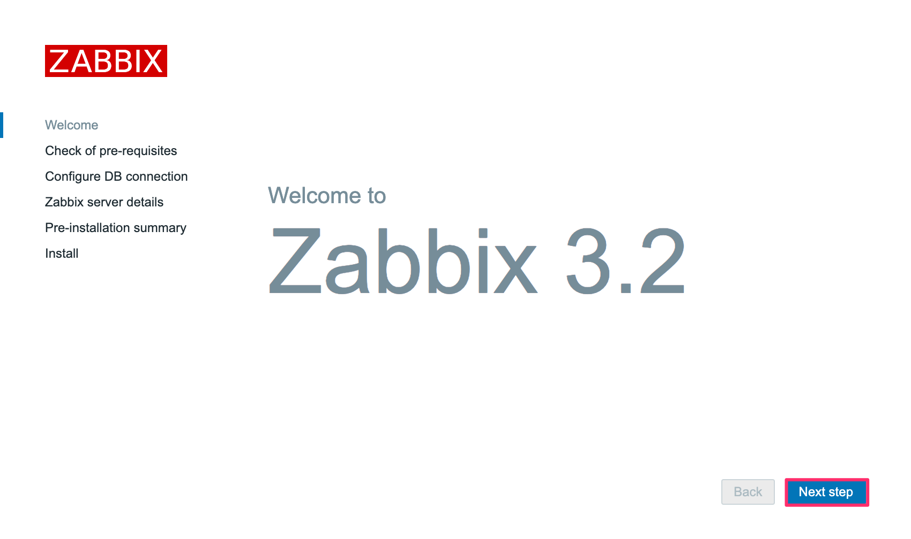

2. 點擊「Next step」以繼續安裝
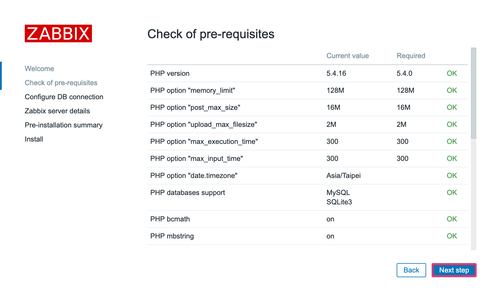

3. 設定資料庫的密碼，這邊設定 123456
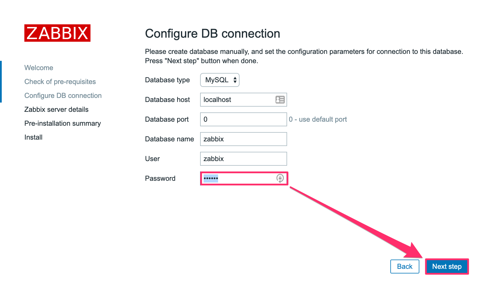

4. 設定 sever 的 Name 為 zabbix
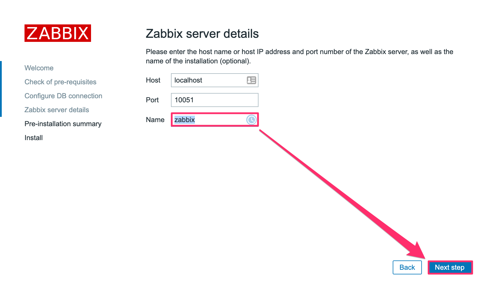

5. 確認剛才輸入的資訊有無錯誤
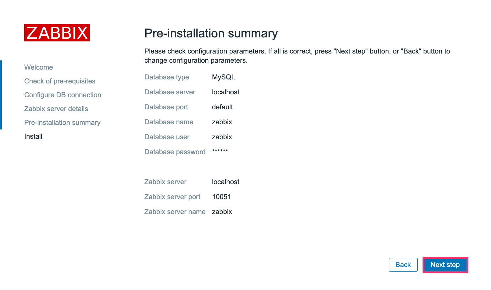

6. 安裝完成
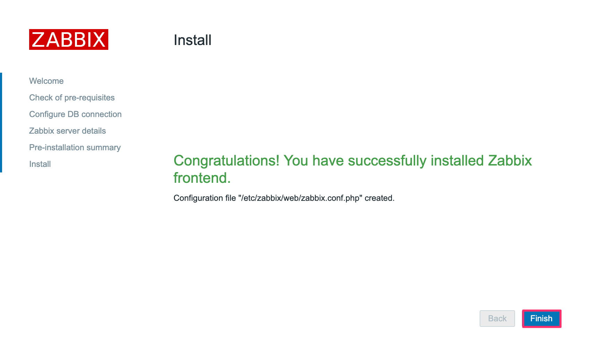

## 登入 webUI 介面來管理
1. 帳號 `Admin`（區分大小寫），密碼 `zabbix`
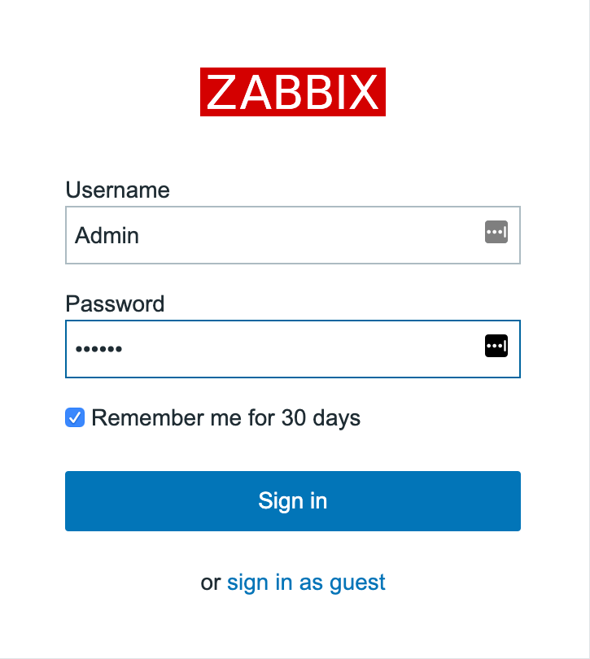

2. 登入成功應會見到此畫面


# 透過 LINE Notify 提醒 Zabbix 訊息
## 取得 LINE Notify 的 Token（存取權杖）
1. 前往 [LINE Notify 官網](https://notify-bot.line.me/zh_TW/)，並點選右上角的登入
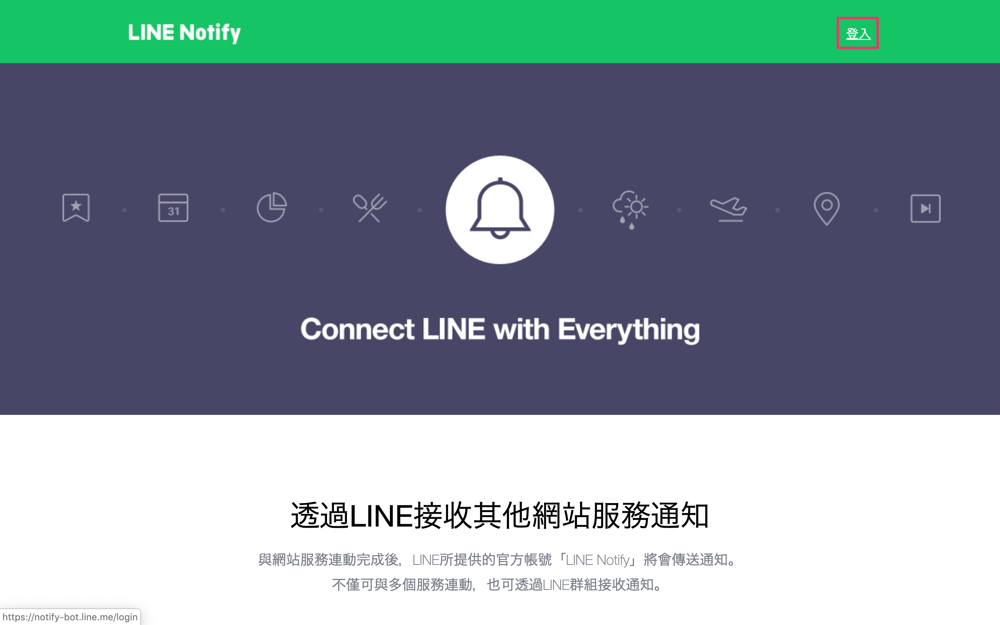

2. 登入 LINE 帳號
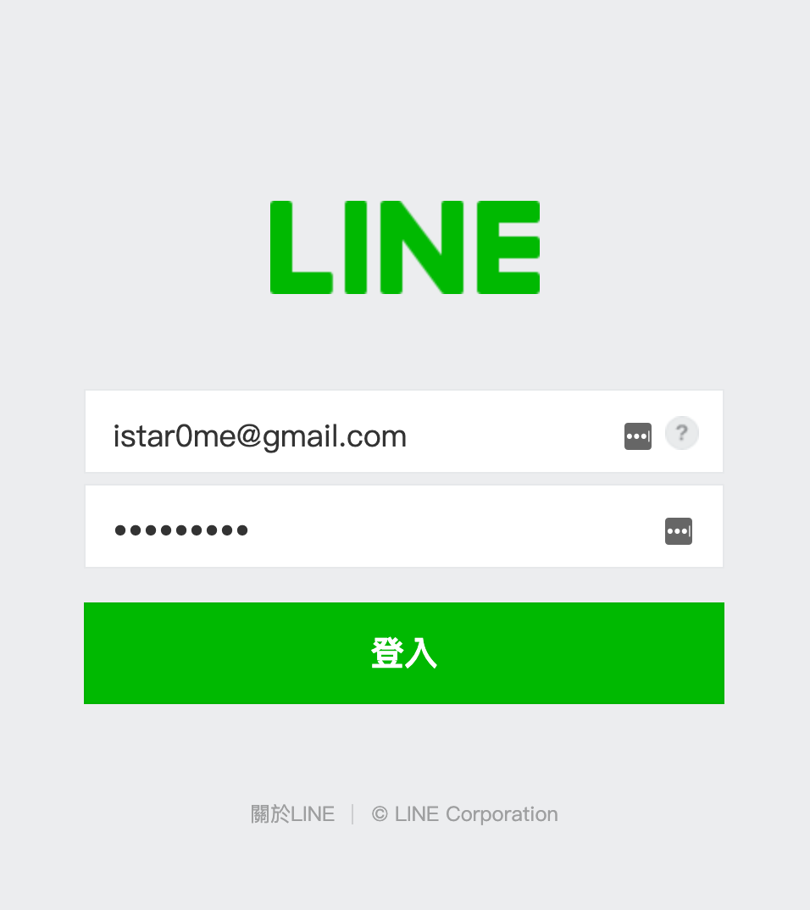

3. 點擊帳號名稱 -> 個人頁面


4. 在發行存取權杖區塊，點擊「發行權杖」
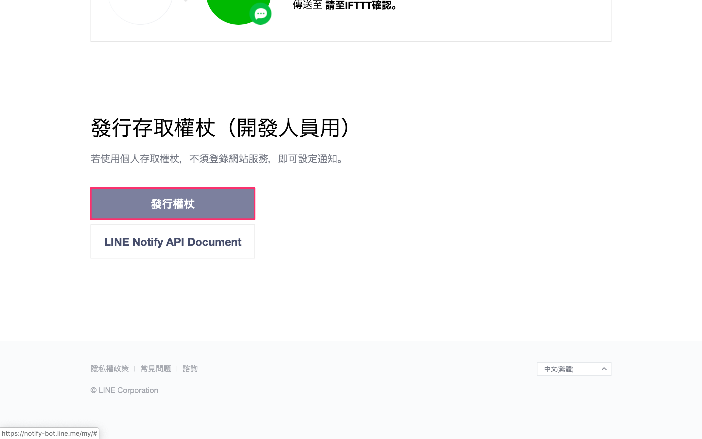

5. 設定權杖名稱，並選擇要接收通知的聊天室（這邊設定一對一通知，但各位也可以設定群組通知，讓所有維護者第一時間掌握）
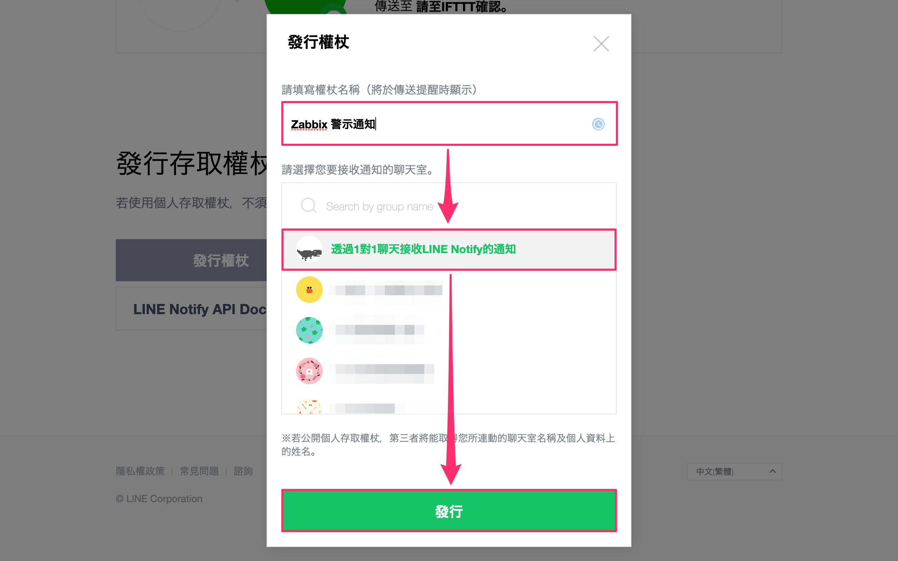

6. 取得發行的權杖（因為只會出現一次，務必要複製起來）
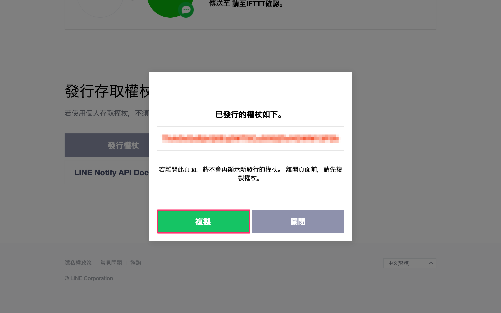

## 撰寫 Zabbix 通知腳本
1. `vim /usr/lib/zabbix/alertscripts/LINE_Notify.sh`，並填入剛才複製的權杖
```sh
#!/bin/sh
export PATH="/usr/local/bin:/bin:/usr/bin:/usr/local/sbin:/usr/sbin:/sbin"
export LANG=C

# LINE Notify API Token（發行權杖）
access_token="＜填入剛才複製的權杖＞"

# 通知主旨
subject=$1

# 通知內文
body=$2

# LINE Notify 實作
curl -X POST -H "Authorization: Bearer ${access_token}" \
-F "message=${subject}: ${body}" \
https://notify-api.line.me/api/notify

exit 0
```

2. 變更腳本的擁有者為 zabbix，並授與執行權限
```
chown zabbix /usr/lib/zabbix/alertscripts/LINE_Notify.sh
chmod 700 /usr/lib/zabbix/alertscripts/LINE_Notify.sh
```

## 新增 LINE Notify 通知類型
1. Administration -> Media types -> Create media type
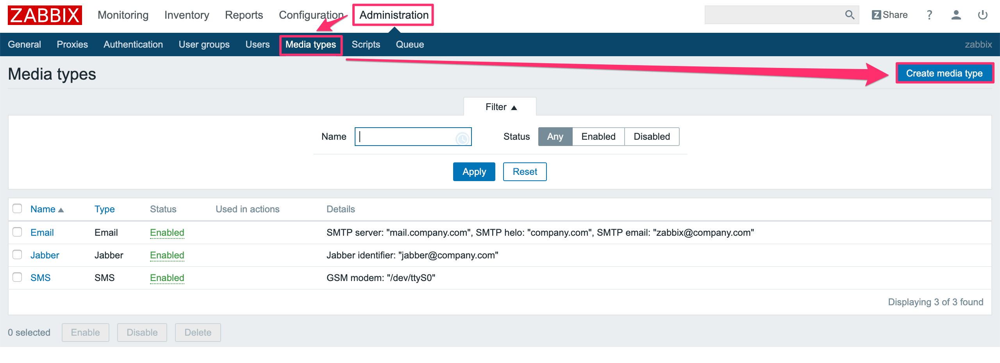

2. 輸入通知類型的名稱為 LINE Notify，選擇 script（腳本）類型，且指定腳本檔案，並點選「Add」新增參數
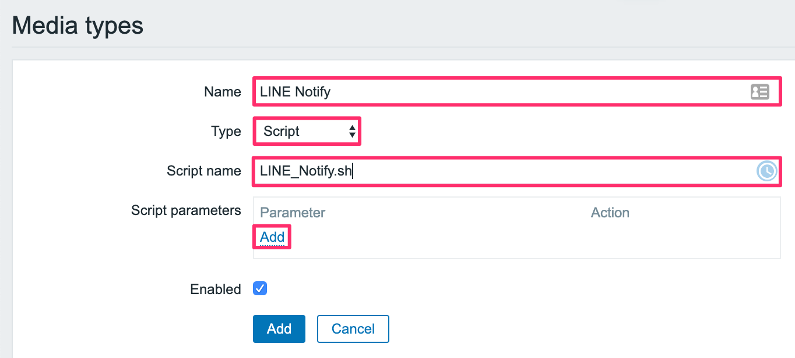

3. 兩個參數依序輸入`{ALERT.SUBJECT}`, `{ALERT.MESSAGE}`，分別對應到[Zabbix 通知腳本](#%E6%92%B0%E5%AF%AB-zabbix-%E9%80%9A%E7%9F%A5%E8%85%B3%E6%9C%AC)的`$1`與`$2`


## 設定透過 LINE Notify 通知
> 指定當 Admin 使用者回報錯誤時，會透過 LINE Notify 來通知

1. Administration -> Users -> Admin


2. Media -> Add
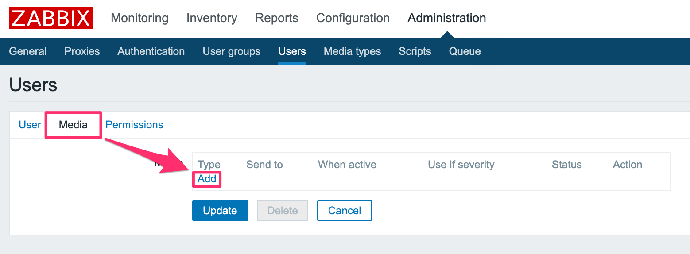

3. 設定型態為 LINE Notify，傳送到 Zabbix 警示通知
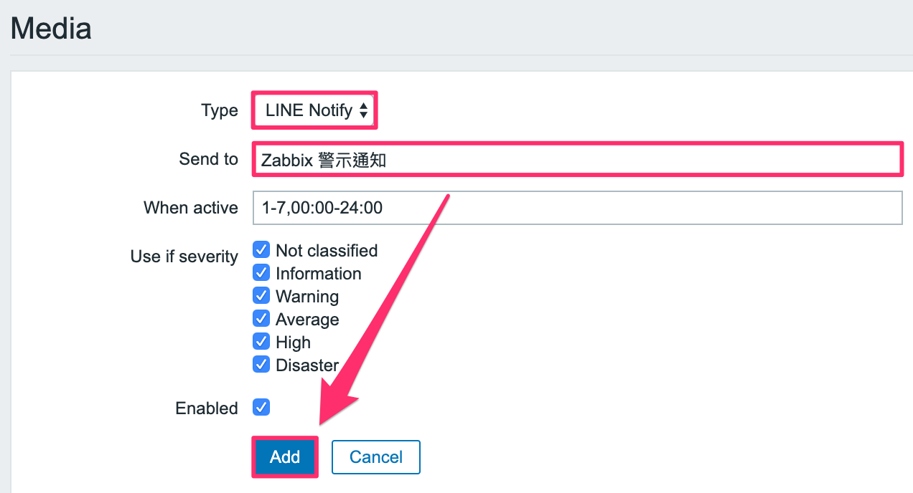

4. 新增後記得要更新，才算儲存成功
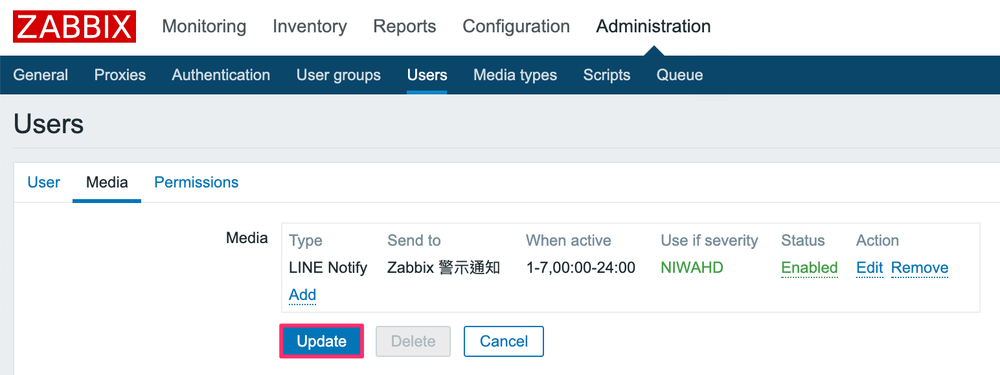

5. 啟用剛才的 Action


6. 如果 Admin 使用者有錯誤訊息時，會在 LINE 中接收到即時的通知
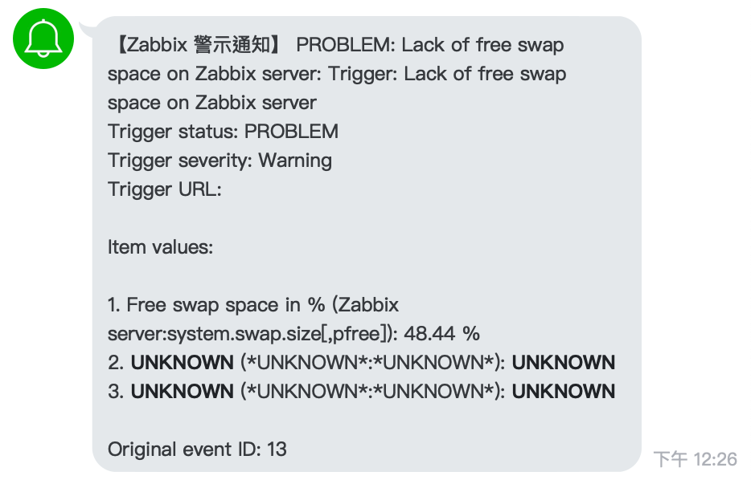
* 註：由於 Zabbix 沒有測試訊息，因此在此是開啟許多網頁來讓 swap 空間不足。

# 參考資料
## 安裝 Zabbix 操作步驟與說明
* [Download Zabbix（官方網站）](https://www.zabbix.com/download)
* [古之技術必有師。: S小魚仔S CentOS 7 Install Zabbix 3.2 網路監控、系統監控 簡易安裝 (一)](http://my-fish-it.blogspot.com/2017/02/ss-centos-7-install-zabbix-32.html)

## 透過 LINE Notify 提醒 Zabbix 訊息
* [如何從Zabbix |中通知“LINE Notify”提醒（日文網頁）](https://blog.apar.jp/zabbix/5892/)
* [5 Custom alertscripts [Zabbix Documentation 3.2]](https://www.zabbix.com/documentation/3.2/manual/config/notifications/media/script)
* [line-notify-api.pdf](https://notify-bot.line.me/static/pdf/line-notify-api.pdf)