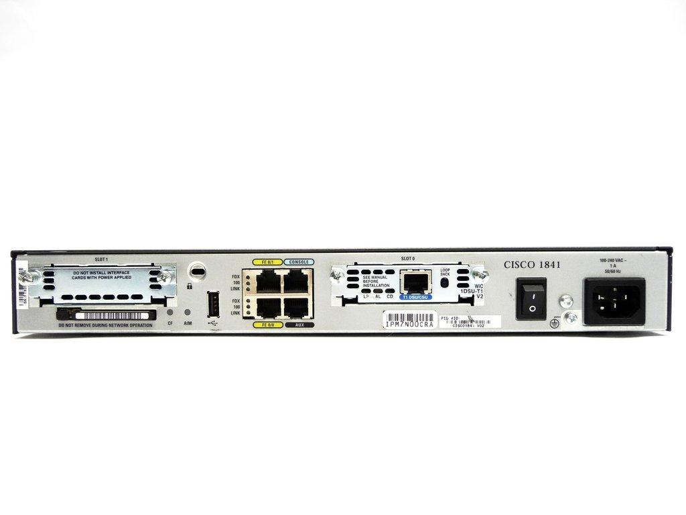
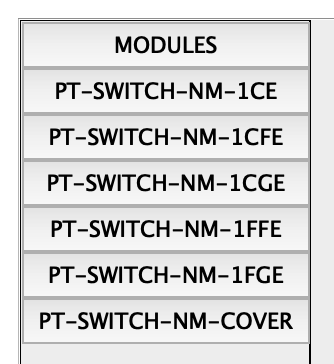
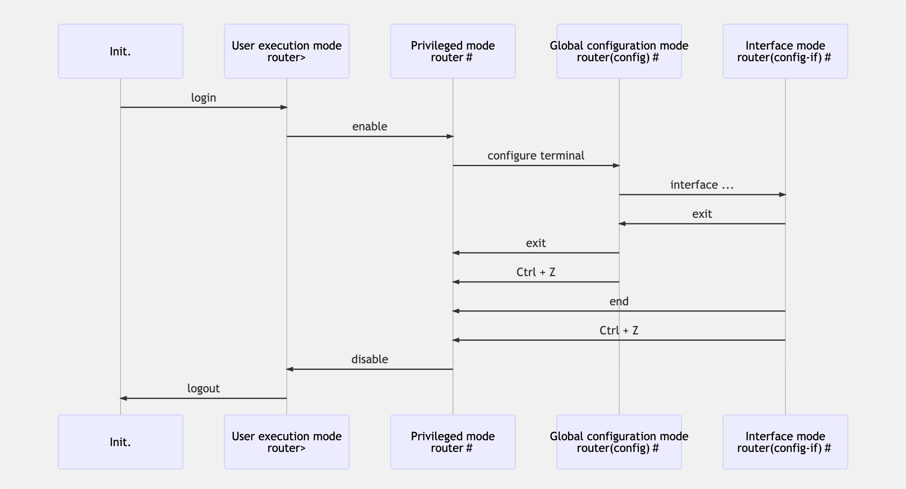
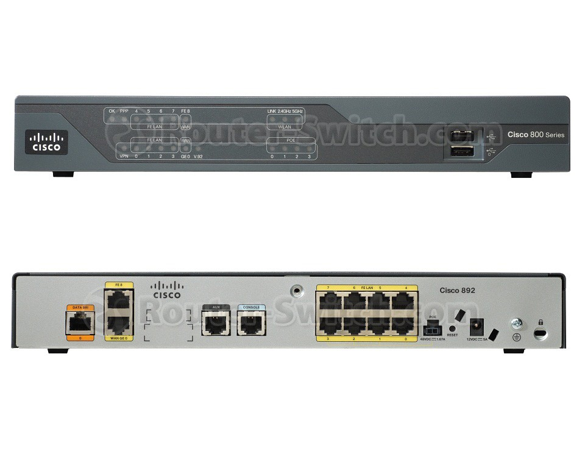

# Cisco Router

- [Cisco Router](#cisco-router)
  - [External Interfaces](#external-interfaces)
  - [OS: IOS](#os-ios)
  - [Boot Process](#boot-process)
  - [Cisco Router Mode](#cisco-router-mode)
  - [Cisco Router Command](#cisco-router-command)
  - [連接到路由器的方法](#%e9%80%a3%e6%8e%a5%e5%88%b0%e8%b7%af%e7%94%b1%e5%99%a8%e7%9a%84%e6%96%b9%e6%b3%95)
  - [加入 config mode 的密碼](#%e5%8a%a0%e5%85%a5-config-mode-%e7%9a%84%e5%af%86%e7%a2%bc)
    - [有兩種密碼儲存方式](#%e6%9c%89%e5%85%a9%e7%a8%ae%e5%af%86%e7%a2%bc%e5%84%b2%e5%ad%98%e6%96%b9%e5%bc%8f)
    - [操作步驟](#%e6%93%8d%e4%bd%9c%e6%ad%a5%e9%a9%9f)
  - [虛擬終端機](#%e8%99%9b%e6%93%ac%e7%b5%82%e7%ab%af%e6%a9%9f)

## External Interfaces

- Cisco 1841:


1. LAN Port: FastEthernet, GigabitEthernet, etc.
2. Console Port: Direct Control
   - The most common way to set up router.
   - 1800 series use RJ-45 connector, 1900 series use USB Type-B connector.
3. AUX Port: Remote Control
   - It uses RJ-45 connector

## OS: IOS

- IOS stands for Internetwork Operating System
- There're two configuration files in the IOS:

| Name          | Stored in | Purpose      |
| ------------- | --------- | ------------ |
| Running Conf. | DRAM      | Testing      |
| Startup Conf. | NVRAM     | Stablization |

<details><summary>Diff between memory</summary>

| Memory    | Specialty                                                                                                               |
| --------- | ----------------------------------------------------------------------------------------------------------------------- |
| ROM       | saving power-on diagnostics, bootstrap                                                                                  |
| Flash ROM | rewritable, saving IOS                                                                                                  |
| NVRAM     | saving startup conf.                                                                                                    |
| DRAM      | - saving running conf.<br>- saving temp files while executing commands.<br>- data will disappear when the power is off. |
</details>

## Boot Process

1. POST (Power On Self Test)
2. bootstrap
3. locate and load the IOS
4. locate the configuration file
   - After Reboot, the start-up file will be cleared, so it must make a copy to running config. file.

- 操作前建議先畫圖，屆時按圖施工即可

<details><summary>CE, CFE, CGE</summary>

| img                           | description                                          |
| ----------------------------- | ---------------------------------------------------- |
|  | - CE: 10 Mbps<br>- CFE: 100 Mbps<br>- CGE: 1000 Mbps |
</details>

## Cisco Router Mode

> ref: [Cisco Router modes - GeeksforGeeks](https://www.geeksforgeeks.org/cisco-router-modes/)

1. User execution mode
2. Privileged mode
   - In Global configuration and Interface mode, insert `do` in the beginning, it will execute in the Privileged mode.
3. Global configuration mode
4. Interface configuration mode
   - `interface fastEthernet 1/0` can be simplified as `interface fa` or `interface fastEthernet 1/`
5. *ROMMON mode*



<details><summary><i>If your device support mermaid, you can click me to see a dynamic version diagram.</i></summary>

```mermaid
sequenceDiagram
participant 0 as Init.
participant 1 as User execution mode<br>router>
participant 2 as Privileged mode<br>router＃
participant 3 as Global configuration mode<br>router(config)＃
participant 4 as Interface mode<br>router(config-if)＃

0->>1:login
1->>2:enable
2->>3:configure terminal
3->>4:interface ...

4->>3:exit
3->>2:exit
3->>2:Ctrl + Z
4->>2:end
4->>2:Ctrl + Z
2->>1:disable
1->>0:logout
```

</details>

## Cisco Router Command

> ref: [Cisco Router 及 Switch 指令](https://home.gamer.com.tw/creationDetail.php?sn=3022918)

- 很多時候可以採用縮寫，如 show 可以省略成 sh，但建議初學者打全名
- `?`：help
- `show`
  - `show flash`：顯示 flash 資料夾 (可以看到存放 IOS 的 `pt1000-i-mz.122-28.bin` )
  - `show version`：查看 IOS 的版本
- `ip addr <IP位置> <子網路遮罩>`
  - 如 `ip addr 192.168.1.254 255.255.255.0`
  - 假設 IP 位置設定錯誤，只要在前方加入 `no`，就能夠移除剛剛的設定
- `no shutdown`：啟動
- `show ip interface brief`：查看 IP 介面卡簡介 (能確認是否成功 )
- `hostname R1`：更改設備的名稱變成 R1

## 連接到路由器的方法

1. Console
   - **第一次操作一定要透過 Console port**
   - 有專用線材，類似於網路線
   - 下圖的 Console：
2. AUX
3. telnet(ssh)

## 加入 config mode 的密碼

### 有兩種密碼儲存方式

1. basic mode（明文儲存）
2. secret mode

- 若同時有這兩種儲存密碼的方式，預設會以較安全的方式當作密碼（secret mode）

### 操作步驟

1. 建立兩個 2811 Router
2. 用跳線連接
3. 先設定好

```
enable
configure terminal
intterface fe0/0
```

4. 輸入以下指令來設定密碼：

```
Router>enable
Router#configure terminal # 或輸入 conf t
Router(config)#hostname R1

# method 1: basic mode
R1(config)#enable password cisco # 設定密碼
R1(config)#do show running-config # 會看見密碼以明文儲存
R1(config)#no enable password # 取消密碼

# method 2: secret mode
R1(config)#enable secret cisco # 以雜湊儲存密碼（非明文）
R1(config)#do show running-config # 會看見密碼以密文儲存
Ctrl + Z
R1>enable
# 此時就要輸入密碼，就輸入剛才設定的密碼 cisco

```

- 此時若在 Router 4 測試 Ping 到 Router 3，會發現第一次 Ping 會失敗，這是因為一開始是發送 ARP 封包

```
show interface fa0/0
show arp
```

## 虛擬終端機

```bash
line vty 0 4 # 建立虛擬終端機，同時最多 5 條連線(0~4)
password ccna # 設定密碼為 ccna
login
exit
```